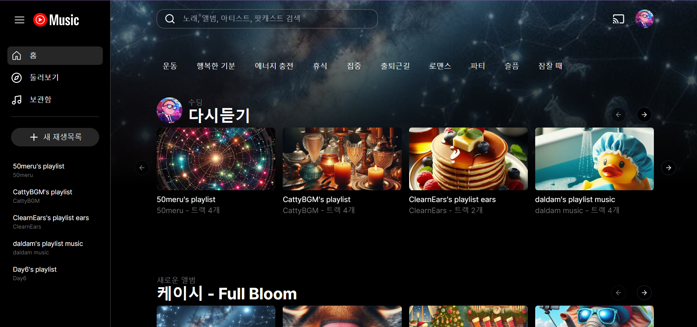
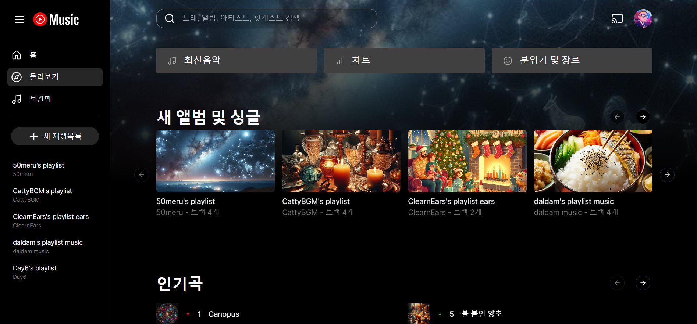
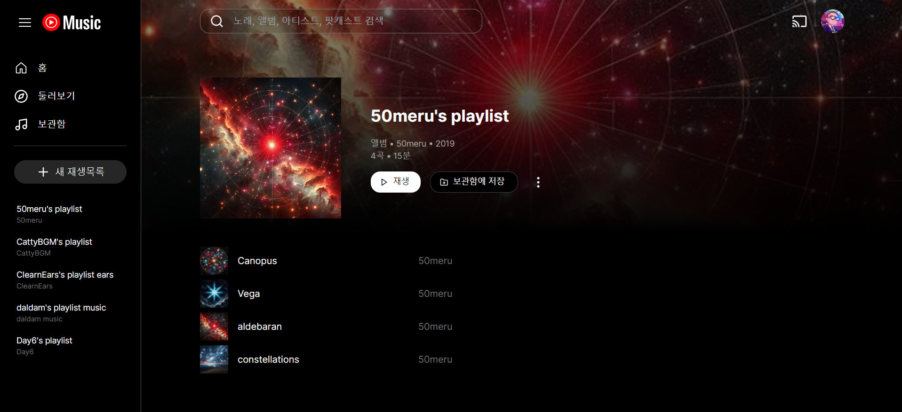
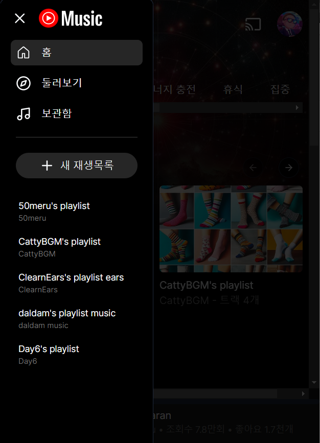
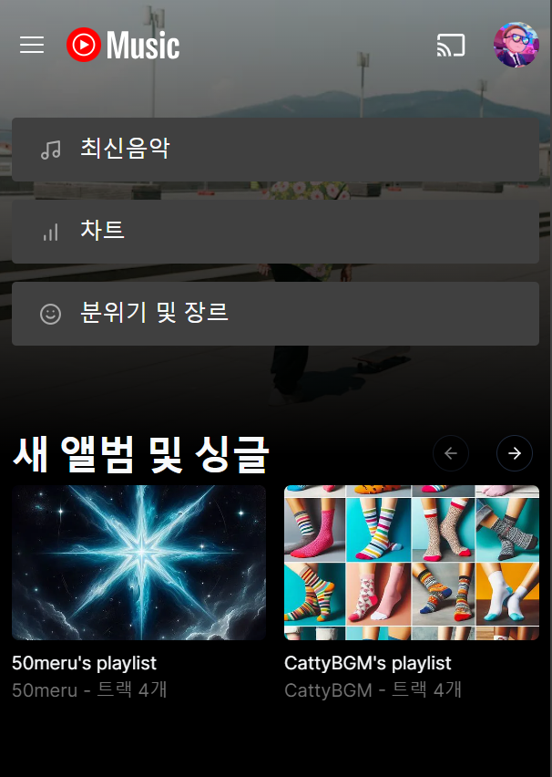
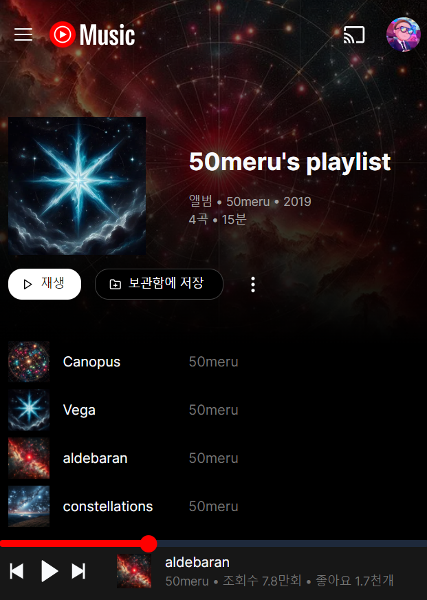

# YouTube-music-clone

**LiveDemo**: [https://yt-music-delta.vercel.app/](https://yt-music-delta.vercel.app/)

## Description

`Next.js` 학습을 통해 기술 스텍을 추가하기 위한 목적의 프로젝트이며, 이 프로젝트를 통해 `App Router`에 대한 이해 및 적용, Next.js의 `렌더링 방식` 및 `CSR`, `SSR`, `Hydration`을 중점적으로 배울 수 있었습니다.

## Installation

1. 리포지토리 복제:

   ```shell
   git clone https://github.com/mulddang2/yt-music-clone.git
   ```

2. 프로젝트 폴더로 이동:

   ```shell
    cd My-Playlist
   ```

3. 프로젝트 의존상태 설치:

   ```shell
    yarn
   ```

4. 개발모드 실행:

   ```shell
    yarn dev
   ```

5. 운영모드 실행:

   ```shell
   yarn build
   yarn preview
   ```

## Usage

- 기본적으로 페이지는  **홈**, **둘러보기**, **보관함**, **채널** 페이지가 있습니다.
- 음악 재생 및 채널 내 셔플 듣기가 가능합니다.

### PC





### Mobile

| Drawer                                            | Explore                                                    | Channel                                                    |
| ------------------------------------------------- | ---------------------------------------------------------- | ---------------------------------------------------------- |
|  |  |  |

## TechStack & Tools


![react-icons](https://img.shields.io/badge/react--icons-ffb6c1?style=for-the-badge&logo=data%3Aimage%2Fsvg%2Bxml%3Bbase64%2CPD94bWwgdmVyc2lvbj0iMS4wIiBlbmNvZGluZz0idXRmLTgiPz4NCjwhLS0gR2VuZXJhdG9yOiBBZG9iZSBJbGx1c3RyYXRvciAxNi4wLjAsIFNWRyBFeHBvcnQgUGx1Zy1JbiAuIFNWRyBWZXJzaW9uOiA2LjAwIEJ1aWxkIDApICAtLT4NCjwhRE9DVFlQRSBzdmcgUFVCTElDICItLy9XM0MvL0RURCBTVkcgMS4xLy9FTiIgImh0dHA6Ly93d3cudzMub3JnL0dyYXBoaWNzL1NWRy8xLjEvRFREL3N2ZzExLmR0ZCI%2BDQo8c3ZnIHZlcnNpb249IjEuMSIgeG1sbnM9Imh0dHA6Ly93d3cudzMub3JnLzIwMDAvc3ZnIiB4bWxuczp4bGluaz0iaHR0cDovL3d3dy53My5vcmcvMTk5OS94bGluayIgeD0iMHB4IiB5PSIwcHgiIHdpZHRoPSI2MDBweCINCgkgaGVpZ2h0PSI2MDBweCIgdmlld0JveD0iMCAwIDYwMCA2MDAiIGVuYWJsZS1iYWNrZ3JvdW5kPSJuZXcgMCAwIDYwMCA2MDAiIHhtbDpzcGFjZT0icHJlc2VydmUiPg0KPGcgaWQ9IkxheWVyXzIiPg0KCTxwYXRoIGZpbGw9Im5vbmUiIHN0cm9rZT0iI0U5MUU2MyIgc3Ryb2tlLXdpZHRoPSIyNCIgc3Ryb2tlLW1pdGVybGltaXQ9IjEwIiBkPSJNMzcxLjk4NywyMjcuNjQxDQoJCWM0Ny42MjgsNDcuNjI4LDg1LjAzOSw5OC43MDgsMTA2LjkxNCwxNDMuNTUyYzI2LjM1OCw1NC4wMzMsMzAuMDk2LDk5LjcyMiwxMS4xMDMsMTE4LjcxNA0KCQljLTE5Ljc5MywxOS43OTMtNjguMjY3LDE1Ljg4NC0xMjUuNzMxLTEyLjk3OWMtNDMuNDQ1LTIxLjgyMS05Mi4wMzEtNTkuMTE5LTEzNy4yNDItMTA0LjMzMQ0KCQljLTQ2LjM1NC00Ni4zNTQtODQuOTUtOTUuNTQ1LTEwNi42NjctMTM5LjgxNmMtMjcuNDgtNTYuMDIzLTMwLjA1Ny0xMDMuNzQzLTEwLjY0My0xMjMuMTU3DQoJCWMxOC44MzgtMTguODM5LDYzLjI0OC0xNi4wNTYsMTE2LjY5NCw5Ljc1N0MyNzEuNTc0LDE0MS4xOTMsMzIzLjg5NSwxNzkuNTQ4LDM3MS45ODcsMjI3LjY0MXoiLz4NCgk8cGF0aCBmaWxsPSJub25lIiBzdHJva2U9IiNFOTFFNjMiIHN0cm9rZS13aWR0aD0iMjQiIHN0cm9rZS1taXRlcmxpbWl0PSIxMCIgZD0iTTI3Mi45MzEsMjAxLjEyNQ0KCQljNjUuMDUyLTE3LjQ2NSwxMjcuOTg5LTI0LjM1NCwxNzcuNzY3LTIwLjkwMmM1OS45NzQsNC4xNiwxMDEuNDIsMjMuNzQ3LDEwOC4zODUsNDkuNjg4DQoJCWM3LjI1OSwyNy4wMzMtMjAuMzQ1LDY3LjA3My03NC4wNTQsMTAyLjQzNGMtNDAuNjA4LDI2LjczMy05Ny4xODksNTAuMTg4LTE1OC45NDEsNjYuNzY5DQoJCWMtNjMuMzEyLDE2Ljk5OC0xMjUuMjA3LDI1Ljg1OC0xNzQuNDA4LDIyLjU1M2MtNjIuMjYtNC4xODEtMTA0Ljg4NC0yNS43ODktMTEyLjAwNC01Mi4zMDYNCgkJYy02LjkwNy0yNS43MzEsMTcuNjg4LTYyLjgxMSw2Ni43NS05Ni4yMTRDMTQ3Ljg3OSwyNDQuOTIzLDIwNy4yNDMsMjE4Ljc2MSwyNzIuOTMxLDIwMS4xMjV6Ii8%2BDQoJPHBhdGggZmlsbD0ibm9uZSIgc3Ryb2tlPSIjRTkxRTYzIiBzdHJva2Utd2lkdGg9IjI0IiBzdHJva2UtbWl0ZXJsaW1pdD0iMTAiIGQ9Ik0yMDAuNDY5LDI3My43MDcNCgkJYzE3LjM1Ny02NS4wODEsNDIuODItMTIzLjA1LDcwLjY3MS0xNjQuNDVjMzMuNTU2LTQ5Ljg4Miw3MS4yMjUtNzYuMDA4LDk3LjE3OC02OS4wODZjMjcuMDQ1LDcuMjEyLDQ3Ljk0OSw1MS4xMjMsNTEuNzYsMTE1LjMxNQ0KCQljMi44ODMsNDguNTMzLTUuMDU1LDEwOS4yNjYtMjEuNTMxLDE3MS4wNDZjLTE2Ljg5Miw2My4zNDEtNDAuMTI2LDEyMS4zODktNjcuNTYyLDE2Mi4zNjUNCgkJYy0zNC43MTYsNTEuODUyLTc0LjcyMyw3Ny45ODgtMTAxLjI1Miw3MC45MTNjLTI1Ljc0My02Ljg2NS00NS41ODQtNDYuNjkyLTUwLjAyMS0xMDUuODgxDQoJCUMxNzUuOTYzLDQwMy45MiwxODIuOTQ0LDMzOS40MjQsMjAwLjQ2OSwyNzMuNzA3eiIvPg0KPC9nPg0KPGcgaWQ9IkxheWVyXzMiPg0KCTxwYXRoIGZpbGw9IiNFOTFFNjMiIGQ9Ik0zMDAsMzQ5LjM2OWMtMS4wMTksMC0xLjg4MS0wLjM1My0yLjU4Ni0xLjA1OGwtMzYuNjc5LTM1LjM4NmMtMC4zOTItMC4zMTMtMC45MzEtMC44MjItMS42MTctMS41MjgNCgkJYy0wLjY4Ni0wLjcwNS0xLjc3My0xLjk4OC0zLjI2Mi0zLjg1MWMtMS40ODktMS44Ni0yLjgyMi0zLjc3MS0zLjk5Ny01Ljczcy0yLjIyNC00LjMzLTMuMTQ1LTcuMTEyDQoJCWMtMC45Mi0yLjc4Mi0xLjM4MS01LjQ4Ni0xLjM4MS04LjExMWMwLTguNjIxLDIuNDg4LTE1LjM2MSw3LjQ2NS0yMC4yMjFjNC45NzctNC44NTksMTEuODU0LTcuMjg5LDIwLjYzMS03LjI4OQ0KCQljMi40MywwLDQuOTA5LDAuNDIxLDcuNDM2LDEuMjY0YzIuNTI3LDAuODQzLDQuODc5LDEuOTc5LDcuMDU0LDMuNDFjMi4xNzQsMS40Myw0LjA0NiwyLjc3Miw1LjYxMyw0LjAyNnMzLjA1NywyLjU4Niw0LjQ2NywzLjk5Nw0KCQljMS40MTEtMS40MTEsMi44OTktMi43NDMsNC40NjctMy45OTdjMS41NjgtMS4yNTQsMy40MzgtMi41OTYsNS42MTQtNC4wMjZjMi4xNzUtMS40MzEsNC41MjUtMi41NjcsNy4wNTQtMy40MQ0KCQljMi41MjctMC44NDIsNS4wMDYtMS4yNjQsNy40MzUtMS4yNjRjOC43NzgsMCwxNS42NTUsMi40MywyMC42MzIsNy4yODljNC45NzgsNC44NTksNy40NjYsMTEuNiw3LjQ2NiwyMC4yMjENCgkJYzAsOC42Ni00LjQ4NywxNy40NzctMTMuNDYxLDI2LjQ1MWwtMzYuNjE5LDM1LjI2OEMzMDEuODgxLDM0OS4wMTcsMzAxLjAxOSwzNDkuMzY5LDMwMCwzNDkuMzY5eiIvPg0KPC9nPg0KPC9zdmc%2BDQo%3D&link=https%3A%2F%2Freact-icons.github.io%2Freact-icons%2F)


## Features

- 음악 듣기 및 셔플 재생
- 반응형 UI
- 상황별(운동, 행복한 기분, 에너지 충전 등) 랜덤한 배경 제공
- 로딩 시, Spinner UI 제공

## Credits

인프런 강의 프로젝트 : [https://github.com/dodokyo/yt-music-clone](https://github.com/dodokyo/yt-music-clone)

## License

이 프로젝트는 MIT 라이선스에 따라 라이선스가 부여됩니다. 자세한 내용은 LICENSE.md 파일을 참조해주세요.

(This project is licensed under the MIT License - see the LICENSE.md file for details)


